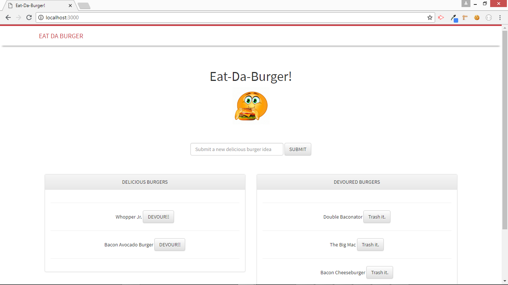

# Burger Logger - Node Express Handlebars MySQL Application
*UCF Coding Bootcamp Week 14 Homework*

## Synopsis

This purpose of this application is to log the names of burgers that users like to eat. The application follows the MVC design pattern and uses Node and MySQL to query and route data into the aplication. It uses [Handlebars](https://handlebarsjs.com/) to generate the HTML.

## Example

Upon executing the application, the user will be navigated to the homepage.

Whenever a user submits a burger's name, the application will display the burger on the left side of the page; waiting to be devoured. Each burger in the waiting area also has a Devour it! button. When the user clicks it, the burger will move to the right side of the page. The application also stores every burger in a database, whether devoured or not.

## Installation

* Clone repo locally -> cd into project folder.
* Run npm install to install dependencies locally.
* Log into localhost mysql shell and source db/schema.sql and db/seeds.sql files in order to create and load initial database data.
    * To do this within mysql shell, use the command source /FULL_PATH_HERE/schema.sql
* Rename EXAMPLE__keys.js to keys.js.
* Inside keys.js file, provide values for your local mysql connection where the schema.sql and seeds.sql files were sourced.
* Run with either npm run debug or simply npm start.

## (...portions under construction)

This application is currently under developed to meet requirements for the UCF Coding Bootcamp.  